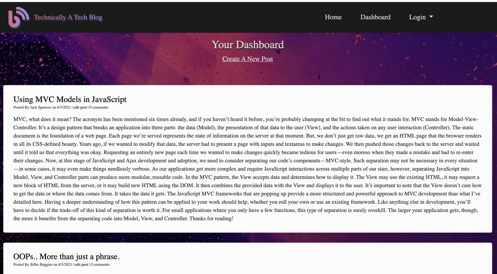

#       MCV Tech Blog

#       Description

        This application was created using the Model-View-Controller (MVC) pattern. Users are required to either login or create a username and password in order to comment, edit, and post articles to the blog page. The users' data is then persistently stored to a Mysql database. Handlebars.js was used for the templating language, Sequelize for the ORM, and express-sessions for authentication.

#       Images

#       Languages Used

        *Handlebars.js
        *JavaScript
        *CSS

#       Dependencies

        *npm mysql2
        *npm sequelize
        *npm connect-session-sequelize
        *npm handlebars
        *npm express
        *npm express-hanldebars
        *npm express-session
        *npm dotenv
        *npm bcrypt
        *npm eslint

#       Installation for localhost

        Clone the repo URL
        Navigate to the root folder
        Open your CLI and run the following commands below:

        * npm install
        * npm run seed
        * npm start

#       Contributors

        * Marisa Hanna

#       Link To Deployed Appllication On Heroku

[https://log-my-blog.herokuapp.com/](https://log-my-blog.herokuapp.com/)

